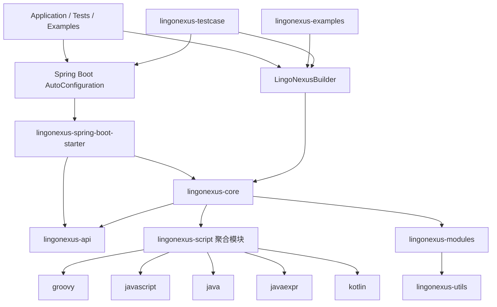
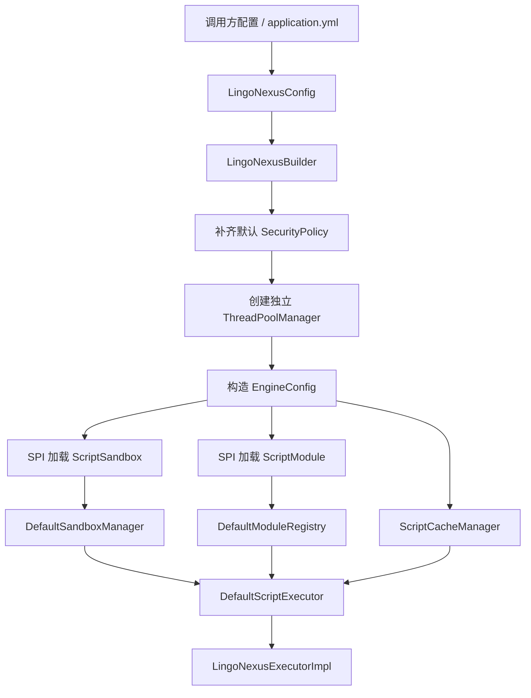
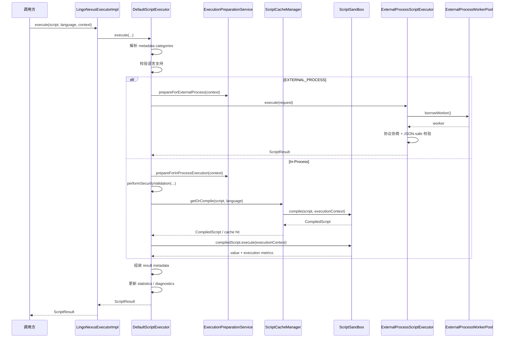

# LingoNexus 当前架构设计与项目流转

> 更新时间：2026-03-08  
> 目标：基于当前仓库代码现状，重新梳理项目架构、核心执行链路、已知约束与下一步开发计划。

> 文档索引：`docs/INDEX.md`  
> 快速开始：`docs/quick-start.md`  
> 诊断说明：`docs/diagnostics.md`

## 1. 文档定位

这份文档以当前代码实现为准，重点回答四个问题：

1. LingoNexus 现在到底由哪些模块组成。
2. 配置、装配、执行、诊断分别落在哪一层。
3. 一次脚本请求从入口到返回是如何流转的。
4. 接下来最值得投入的开发方向是什么。

相较于仓库中较早期的说明文档，当前代码已经发生了几个重要演进：

- 统一门面已经是 `LingoNexusExecutor`，而不是旧文档里的 `ScriptEngineFacade`。
- JavaScript 实现已经切换为 `GraalJSSandbox`，而不是旧文档里的 Rhino。
- 执行隔离模型已经统一为 `AUTO`、`DIRECT`、`ISOLATED_THREAD`、`EXTERNAL_PROCESS` 四种模式。
- `EXTERNAL_PROCESS` 已经不是一次一进程的概念验证，而是持久化 worker pool。
- 执行结果已支持更细粒度的 metadata profile / policy / categories 与 runtime diagnostics。

---

## 2. 当前项目概览

### 2.1 项目目标

LingoNexus 是一个面向 Java 应用嵌入场景的多语言脚本执行引擎。当前设计目标可以概括为四点：

- **多语言**：统一支持 Groovy、JavaScript、Java、Java 表达式、Kotlin。
- **可控执行**：通过白名单/黑名单、超时、隔离策略控制脚本能力边界。
- **可扩展**：通过 SPI 扩展脚本沙箱、脚本模块和部分策略能力。
- **可观测**：输出缓存、编译、执行、队列等待、外部进程协议信息等诊断数据。

### 2.2 当前技术基线

- **构建方式**：Maven 多模块工程。
- **Java 基线**：根 `pom.xml` 当前配置为 Java 17。
- **核心门面**：`LingoNexusExecutor`。
- **用户装配入口**：`LingoNexusBuilder` 与 Spring Boot 自动配置。
- **脚本语言实现**：Groovy、GraalJS、Java、JavaExpr、Kotlin。
- **隔离模式**：`AUTO`、`DIRECT`、`ISOLATED_THREAD`、`EXTERNAL_PROCESS`。
- **缓存层**：当前稳定启用的是编译缓存 `ScriptCacheManager`（基于 Caffeine）。
- **诊断输出**：`EngineStatistics`、`EngineDiagnostics`、`ExternalProcessStatistics`。

### 2.3 当前已知约束

- `EXTERNAL_PROCESS` 模式当前仅稳定支持 **JSON-safe** 的变量、metadata 与结果值。
- 自定义 `SecurityPolicy` 在外部进程模式下已有 descriptor 传递机制，但兼容面仍有限。
- 运行时动态注册模块可以被描述与同步，但外部 worker 侧的完整镜像能力仍未完全闭环。
- 部分仓库级 Maven 校验仍受本地环境与既有构建问题影响，当前更适合做模块化验证而不是全仓无差别验证。

---

## 3. 模块架构

### 3.1 模块分层图

### 3.2 各模块职责

| 模块 | 角色 | 当前职责 |
| --- | --- | --- |
| `lingonexus-api` | 公共契约层 | 定义配置、上下文、执行器、沙箱、结果、异常、统计与隔离策略接口 |
| `lingonexus-core` | 核心实现层 | Builder、执行器、缓存、上下文准备、模块注册、外部进程执行、统计与诊断 |
| `lingonexus-script` | 语言实现聚合层 | 聚合多语言脚本子模块，本身主要承担模块组织作用 |
| `lingonexus-script-groovy` | 语言沙箱 | Groovy 编译与执行、AST 安全控制、受限类加载 |
| `lingonexus-script-javascript` | 语言沙箱 | 基于 GraalJS 的 JavaScript 编译执行与 host access 控制 |
| `lingonexus-script-java` | 语言沙箱 | Java 脚本执行支持 |
| `lingonexus-script-javaexpr` | 语言沙箱 | 轻量 Java 表达式执行支持 |
| `lingonexus-script-kotlin` | 语言沙箱 | Kotlin 脚本执行支持 |
| `lingonexus-utils` | 底层工具层 | 为模块和执行逻辑提供通用工具能力 |
| `lingonexus-modules` | 内置模块层 | 注入 `math`、`str`、`date`、`json`、`validator`、`formatter`、`codec`、`convert`、`col` 等能力 |
| `lingonexus-spring-boot-starter` | 集成层 | 绑定配置、构建 `LingoNexusConfig`、注册自动配置 Bean |
| `lingonexus-examples` | 示例层 | 展示独立模式与集成模式的使用方式 |
| `lingonexus-testcase` | 验证层 | 验证无 Spring 与 Spring Boot 场景的集成行为 |

### 3.3 当前依赖方向

当前工程采用比较清晰的依赖方向：

- `api` 只定义契约，不承载具体语言实现。
- `core` 依赖 `api`，负责拼装运行时对象和主执行链路。
- 各语言沙箱模块依赖 `api`，由 `core` 通过 SPI 发现和接入。
- `modules` 负责脚本上下文中的能力暴露，不直接决定执行链路。
- `spring-boot-starter` 位于最外层，将 Spring 配置转换成 `LingoNexusConfig` 后交给 Builder。

这种结构保证了引擎可以同时支持：

- 无 Spring 的纯 Java 集成。
- Spring Boot 自动装配。
- 单元测试 / 基准测试 / 外部 worker 模式下的复用。

---

## 4. 核心对象与职责边界

### 4.1 配置对象分层

| 对象 | 所处阶段 | 作用 |
| --- | --- | --- |
| `LingoNexusConfig` | 用户装配阶段 | 面向调用方的高层配置对象，聚合缓存、沙箱、执行器、模块过滤、metadata policy 等设置 |
| `EngineConfig` | 运行时阶段 | Builder 归一化后的运行时配置，补齐线程池、默认安全策略、sandbox/module registry 等运行期依赖 |
| `SandboxConfig` | 执行控制阶段 | 控制脚本大小、超时、隔离模式、外部进程参数、类白名单/黑名单 |
| `ExecutorConfig` | 线程池阶段 | 控制异步执行与隔离线程池的大小、队列和拒绝策略 |

可以把两层配置理解为：

- `LingoNexusConfig` 负责“**我要什么能力**”。
- `EngineConfig` 负责“**运行时到底怎么装起来**”。

### 4.2 关键运行时组件

| 组件 | 角色 | 说明 |
| --- | --- | --- |
| `LingoNexusBuilder` | 装配入口 | 负责把 `LingoNexusConfig` 转换成 `EngineConfig`，并加载 sandbox/module/security policy |
| `LingoNexusExecutorImpl` | 外观门面 | 对外暴露同步、异步、批量执行能力 |
| `DefaultScriptExecutor` | 主执行器 | 承载核心执行链路、缓存、统计、外部进程分流 |
| `DefaultSandboxManager` | 沙箱注册中心 | 按语言管理 `ScriptSandbox` |
| `DefaultModuleRegistry` | 模块注册中心 | 管理脚本模块及其版本变化 |
| `ExecutionPreparationService` | 上下文准备器 | 合并全局变量、请求变量、模块快照 |
| `ScriptCacheManager` | 编译缓存层 | 基于脚本内容 + 语言缓存 `CompiledScript` |
| `ExternalProcessScriptExecutor` | 外部进程执行桥 | 负责请求序列化、worker 借还、协议协商、失败分类 |
| `ExternalProcessWorkerPool` | 外部 worker 池 | 管理 worker 创建、预热、借还、淘汰、健康检查 |

### 4.3 沙箱抽象

所有语言实现都基于 `ScriptSandbox` 契约接入，并继承 `AbstractScriptSandbox` 复用统一能力：

- 统一接收 `EngineConfig` / `SandboxConfig`。
- 统一通过 `ScriptIsolationStrategyFactory` 创建隔离策略。
- 统一记录队列等待、执行时间、wall time 等 metadata。
- 各语言只需要聚焦自己的编译、变量绑定、结果转换与语义级安全控制。

这也是当前架构比较稳定的一点：**语言差异被尽量收敛到沙箱内部，执行主链路不需要为每种语言写一套逻辑**。

---

## 5. 初始化与装配流程

### 5.1 两条主要装配路径

当前存在两条稳定入口：

1. **独立模式**：调用方直接构造 `LingoNexusConfig`，再交给 `LingoNexusBuilder`。
2. **Spring Boot 模式**：`LingoNexusAutoConfiguration` 从 `LingoNexusProperties` 绑定配置，构造 `LingoNexusConfig` 后交给 Builder。

### 5.2 装配流程图

### 5.3 Builder 阶段发生了什么

`LingoNexusBuilder` 当前会完成以下工作：

1. 校验 `LingoNexusConfig` 非空。
2. 为当前引擎创建独立的 `ThreadPoolManager`，避免依赖隐藏的全局线程池。
3. 合并调用方提供的安全策略与内置默认策略。
4. 以 `LingoNexusConfig` 为输入构建 `EngineConfig`。
5. 根据允许语言、host access、transport capability、external-process compatibility 等条件筛选并加载 `ScriptSandbox`。
6. 根据 allow/exclude 配置加载脚本模块。
7. 创建 `ScriptCacheManager`、`DefaultScriptExecutor` 和 `LingoNexusExecutorImpl`。
8. 将最终上下文挂入 `LingoNexusContext`，供全局访问与清理。

### 5.4 Spring Boot 自动配置承担的职责

`lingonexus-spring-boot-starter` 当前主要负责：

- 绑定 `lingonexus.*` 配置。
- 将 `global-variables` 注册进 `GlobalVariableManager`。
- 构造 metadata policy registry。
- 将 Spring 配置转换成 `LingoNexusConfig`。
- 暴露 `LingoNexusExecutor` Bean。

换句话说，Spring Boot Starter 并不重写执行逻辑，只是替调用方完成一层“配置转运行时装配”。

---

## 6. 单次脚本请求的流转流程

### 6.1 执行时序图

### 6.2 请求主链路拆解

#### 第 1 步：门面归一化

`LingoNexusExecutorImpl` 负责最外层的统一入口：

- 为空语言回填默认语言。
- 为空上下文回填空的 `ScriptContext`。
- 对同步、异步、批量执行做统一封装。
- 在 shutdown 后阻止继续提交请求。

#### 第 2 步：执行器创建结果元数据骨架

`DefaultScriptExecutor` 在真正执行前会：

- 解析请求级 metadata policy / categories 覆盖项。
- 初始化结果 metadata，写入语言、隔离模式等基础字段。
- 校验当前语言是否存在可用 sandbox。

#### 第 3 步：准备执行上下文

`ExecutionPreparationService` 是当前主链路中非常关键的一个优化点。它负责：

- 读取全局变量快照。
- 读取模块快照。
- 合并请求变量。
- 生成真正供执行使用的 `ScriptContext`。

当前实现中，准备逻辑区分两种场景：

- **In-Process**：把模块对象直接注入执行上下文。
- **EXTERNAL_PROCESS**：只传递 JSON-safe 变量，模块则通过 descriptor 机制由 worker 侧重建。

为了降低热路径拷贝成本，它对全局变量和模块快照都做了基于 version 的缓存。

#### 第 4 步：安全校验

在 in-process 主链路中，`DefaultScriptExecutor` 会执行 `performSecurityValidation`：

- 遍历配置好的 `SecurityPolicy`。
- 使用 `SandboxConfig` 中的大小限制、白名单、黑名单等参数进行校验。
- 将通过的安全检查次数记录到结果 metadata。

此外，各语言 sandbox 在编译阶段通常还会做语言特定校验：

- Groovy：`SecureASTCustomizer` + 受限类加载器 + 静态检查。
- GraalJS：`allowHostClassLookup` + whitelist/blacklist + 静态检查。
- 其他语言：各自实现自己的编译与运行期控制。

#### 第 5 步：编译与缓存

`ScriptCacheManager` 负责缓存 `CompiledScript`。缓存 key 会综合脚本内容、语言以及编译上下文签名。对于 Janino-backed Java，当前实现已经把上下文变量类型形状纳入 `compilationContextSignature`，避免不同变量类型组合错误复用同一份编译结果。

执行器逻辑如下：

- 如果开启 `CacheConfig.enabled`，先走 `getOrCompile`。
- 未命中时调用对应 `ScriptSandbox.compile(...)`。
- 记录是否命中缓存、编译耗时、缓存等待耗时。

这使得脚本执行主链路被稳定拆成两段：

1. **编译阶段**：可缓存。
2. **执行阶段**：拿到 `CompiledScript` 后真正运行。

#### 第 6 步：按隔离策略执行

真正的隔离策略是在 `AbstractScriptSandbox` 内部通过 `ScriptIsolationStrategyFactory` 统一创建的。

当前规则如下：

- `DIRECT`：直接在调用线程执行，仅做必要的 ClassLoader 切换。
- `ISOLATED_THREAD`：进入隔离线程池执行，支持超时控制与队列等待统计。
- `EXTERNAL_PROCESS`：由外部 worker JVM 执行。
- `AUTO`：当 `timeoutMs > 0` 时退化为 `ISOLATED_THREAD`，否则走 `DIRECT`。

也就是说，**主执行器负责选择大分支，语言沙箱负责在 in-process 分支里真正执行隔离策略**。

#### 第 7 步：结果汇总与统计

成功执行后，系统会输出或更新：

- `executionTime`
- `queueWaitTime`
- `wallTime`
- `totalTime`
- `compileTime`
- `cacheWaitTime`
- `securityValidationTime`
- `cacheHit`
- `modulesUsed`

并同步写入：

- `EngineStatistics`
- `EngineDiagnostics`
- 外部进程相关统计快照

失败时会根据异常类型映射为：

- `SECURITY_VIOLATION`
- `TIMEOUT`
- `COMPILATION_ERROR`
- `FAILURE`

---

## 7. 外部进程执行架构

### 7.1 为什么单独看这一层

`EXTERNAL_PROCESS` 是当前项目最有演进性的子系统。它已经不只是“把脚本丢到另一个 JVM 里跑”，而是形成了一个相对独立的执行子架构。

### 7.2 外部进程链路分层

| 组件 | 作用 |
| --- | --- |
| `ExternalProcessExecutionRequestFactory` | 将脚本、执行变量、policy、module descriptor、metadata policy 等打包成请求 |
| `ExternalProcessScriptExecutor` | 校验 JSON-safe、借还 worker、执行协议协商、错误分类 |
| `ExternalProcessWorkerPool` | 负责 worker 创建、预热、借还、闲置淘汰、健康检查 |
| `ExternalProcessWorkerClient` | 与单个 worker 进程通信 |
| `ExternalProcessWorkerMain` | 外部 worker 入口 |
| `ExternalProcessProtocolCodec` | JSON 长度前缀协议编解码（默认 64 MB 帧上限） |

### 7.3 当前工作方式

外部进程模式当前的关键特征：

- 使用 **持久化 worker pool**，而不是每次执行都重新启动 JVM。
- 请求在进入 worker 前会做 **JSON-safe 检查**。
- worker 借出与归还前后都会做健康检查。
- 支持 `startupRetries`、`prewarmCount`、`idleTtlMs` 等运行参数。
- 协议层会校验 transport capabilities 与 serializer contracts。
- worker 侧统计会被回传成 `ExternalProcessStatistics` 的一部分。

### 7.4 当前边界与不足

外部进程模式虽然已经可用，但仍有几个边界要明确写出来：

- 对象图必须接近 JSON 数据模型，复杂对象、闭包、非字符串 key 的 map 等场景仍然受限。
- 自定义 `SecurityPolicy` 与动态模块虽然有 descriptor 方案，但兼容性不是完全透明的。
- 当前 diagnostics 能看到累计失败数，但“最近一次协议不匹配原因”的表达还不够直接。
- 这部分是最需要继续补测试和观测的区域。

---

## 8. 安全、缓存与可观测性设计

### 8.1 安全控制是分层的

当前安全并不是单点实现，而是多层叠加：

1. **静态限制**：脚本大小、类白名单/黑名单。
2. **策略校验**：`SecurityPolicy` 责任链。
3. **语言级限制**：Groovy AST、GraalJS host lookup 等。
4. **执行级限制**：超时、隔离线程池、外部进程。

这意味着系统安全边界并不完全依赖单一语言沙箱，而是通过“策略 + 沙箱 + 隔离”的组合实现。

### 8.2 缓存当前主要聚焦编译缓存

当前稳定缓存层是 `ScriptCacheManager`：

- value 是 `CompiledScript`。
- 由 `DefaultScriptExecutor` 统一控制命中与写入。
- Caffeine 负责容量和过期策略。

外部进程侧还额外维护 worker 内部 executor cache 统计，但这部分仍主要服务于诊断和后续优化。

### 8.3 诊断能力已经成为正式能力

当前不再只是“打日志”，而是有明确的数据出口：

- `EngineStatistics`：执行总量、成功失败、缓存命中等。
- `EngineDiagnostics`：聚合 cache size、线程池状态、外部进程统计、隔离模式等。
- `ExternalProcessStatistics`：worker 数、借还次数、丢弃次数、预热/启动失败、health check 失败、协议能力等。

这说明项目已经从“功能实现阶段”进入“可运行、可分析、可迭代优化阶段”。

---

## 9. 当前架构中的文档与实现偏差

为了避免后续继续在旧语义上开发，这里显式列出当前最重要的偏差：

- 旧文档大量使用 `ScriptEngineFacade`，而代码当前主门面是 `LingoNexusExecutor`。
- 旧文档描述 JavaScript 基于 Rhino，当前代码是 GraalJS。
- 旧文档中存在 `lingonexus-spring`、`ScriptEngineFacadeBean` 等规划性内容，但当前根模块实际以 `lingonexus-spring-boot-starter` 为主。
- 旧文档中的部分“待创建文件清单”已经失效，不能再作为代码现状依据。
- 隔离模式、外部进程 worker pool、metadata policy 体系在旧文档中描述不足或已经过时。

因此，后续再写 README、Quick Start、开发计划时，应以本文为当前基线，而不是继续沿用早期架构草案。

---

## 10. 建议的下一步开发计划

### 10.1 总体判断

当前项目最核心的方向已经不是“再支持一种语言”，而是把 **外部进程模式、观测能力、兼容性和热路径开销** 做扎实。

### 10.2 建议路线图

| 阶段 | 优先级 | 目标 | 主要工作 |
| --- | --- | --- | --- |
| Phase 1 | P0 | 补齐外部进程可用性 | 扩展 descriptor/factory/consumer 之外的兼容面，增强非 JSON-safe 值的预检查与错误提示 |
| Phase 2 | P0 | 补齐外部进程稳定性与测试 | 增加 worker reuse、timeout replacement、health-check recovery、startup retry 等测试 |
| Phase 3 | P1 | 强化诊断与可观测性 | 输出最近一次协议协商失败原因，补 runtime diagnostics 示例与观测说明 |
| Phase 4 | P1 | 优化热路径 | 减少 direct path metadata 分配，评估拆分 compile-time / request-time / runtime security evaluation |
| Phase 5 | P2 | 形成性能基线 | 对 `DIRECT`、`ISOLATED_THREAD`、`EXTERNAL_PROCESS` 建立统一 benchmark 与记录模板 |
| Phase 6 | P3 | 长期硬化 | 评估二进制协议、worker idle scaling、OS 级 sandbox hardening |

当前执行计划以里程碑 M1–M4 管理，建议映射关系如下：

- M1：Phase 1 + Phase 2（外部进程可用性/稳定性与测试）
- M2：Phase 3（诊断与可观测性）
- M3：Phase 4（热路径优化）
- M4：Phase 5 + Phase 6（性能基线 + 长期硬化）

### 10.3 更具体的近期任务清单

建议优先按下面顺序推进：

1. **M1：外部进程兼容性补强**
   - 增加更严格的 JSON-safe compatibility check。
   - 改进 `ExternalProcessCompatibilityException` 的错误分类与可读性。
   - 明确模块 descriptor 与安全策略 descriptor 的兼容边界。

2. **M1：外部进程恢复能力测试**
   - 增加 worker reuse 测试。
   - 增加 timeout 后 worker replacement 测试。
   - 增加 health-check failure recovery 测试。
   - 增加 external-process failure metadata 测试。

3. **M2：诊断与文档补齐**
   - 编写如何读取 `EngineDiagnostics` / `ExternalProcessStatistics` 的样例。
   - 增加协议协商失败的最近原因聚合，而不是只有累计计数。

4. **M3：执行热路径优化**
   - 评估 request metadata 复制成本。
   - 拆分必须 metadata 与可选 diagnostics metadata。
   - 进一步减少 direct path 上的瞬时对象分配。

### 10.4 完成这些工作的标志

如果下一阶段做完，项目应该达到以下状态：

- `EXTERNAL_PROCESS` 不再只是“能跑”，而是“边界清楚、失败可解释、恢复可验证”。
- 调用方能稳定拿到足够的诊断信息，而不是只能依赖日志猜测问题。
- direct path 与 isolated path 的性能差异可以被量化，而不是凭经验判断。
- 文档、代码、测试三者口径重新统一。

---

## 11. 结论

LingoNexus 当前已经具备一个成熟脚本引擎应有的主体结构：

- 契约层、实现层、语言层、模块层、集成层边界清晰。
- 主执行链路已经稳定收敛到 `Builder → Executor → Sandbox → Result/Diagnostics` 模型。
- 真正有价值的下一步，不是继续扩散功能面，而是把外部进程隔离、兼容性、测试和观测能力做深。

后续所有架构讨论、README 修订和开发计划拆解，建议都以本文作为当前版本基线。
